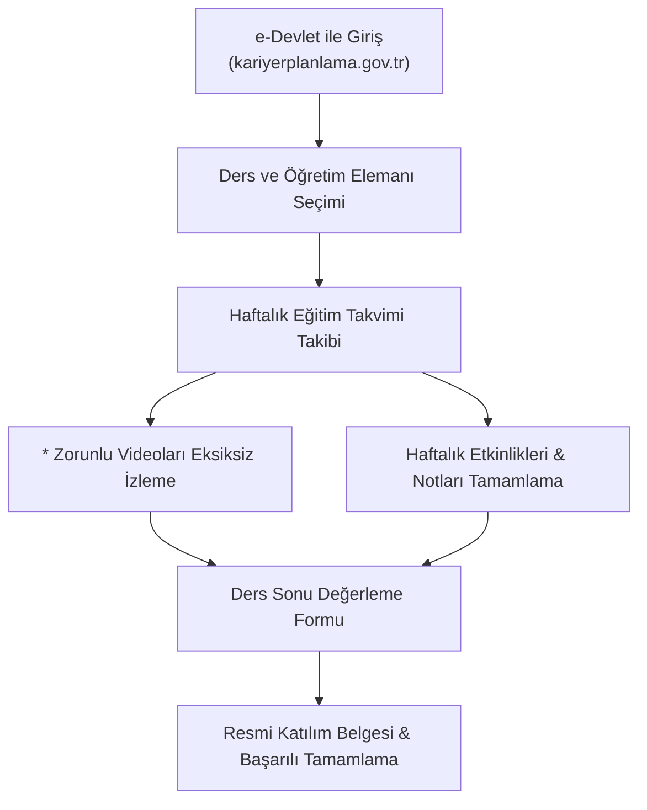

## 📌 Ders Künyesi ve Bilgileri

| Özellik | Detay |
| :--- | :--- |
| **Ders Adı** | Kariyer Planlama |
| **Ders Kodu** | `KPD1001` / `YZM2053` (Tüm 1. Sınıf Programları) |
| **Akademik Birim** | Uygulamalı Bilimler Fakültesi (UBF) |
| **Bölüm** | Yapay Zeka ve Makine Öğrenmesi Bölümü (Tüm Bölümler İçin Uyarlanabilir) |
| **Dönem** | Güz / Bahar Dönemi |
| **Ders Türü** | Zorunlu / Uygulamalı Kariyer & Yetkinlik Geliştirme Dersi |
| **Öğretim Elemanı** |  |
| **Ders Yönetim Platformu** | [Kariyer Planlama Platformu (kariyerplanlama.gov.tr)](https://kariyerplanlama.gov.tr) |
| **Ulusal İstihdam Portalı** | [T.C. Cumhurbaşkanlığı İKO Yetenek Kapısı](https://www.yetenekkapisi.org/) |

---

## 🎯 Dersin Amacı ve Vizyonu

Kariyer bilincinin yükseköğretimin erken döneminde oluşturulması; öğrencilerin eğitimlerine, yeteneklerine ve kişisel özelliklerine en uygun alanlarda istihdam edilmelerini mümkün kılar. 

Kariyer Planlama Dersi'nin temel amacı; öğrencilerin kariyerlerini kendi **zekâ, kişilik, bilgi, beceri, yetenek ve yetkinliklerine** uygun olarak belirleyebilmeleri için yol göstermektir. 

Ders kapsamında:
- Bu kavramlar hakkında derinlemesine farkındalık yaratılacak,
- Üniversite hayatı boyunca öğrencilerin kariyerleri hakkında destek alabilecekleri **Kariyer Merkezleri** ve faaliyetleri tanıtılacak,
- Farklı sektörlerde (Sivil Toplum, Kamu, Özel Sektör, Akademi, Girişimcilik) çalışma hayatı ile tanışma fırsatı sunulacak,
- Davet edilen sektör profesyonelleri, akademisyenler ve girişimcilerin deneyimleri aktarılacak,
- Profesyonel yaşamın gereklilikleri, modern öz geçmiş (CV) hazırlama ve dijital kimlik oluşturma hususlarında pratik beceriler kazandırılacaktır.

---

## 🚀 Temel Öğrenme Çıktıları (Kazanımlar)

Kariyer Planlama Dersi'ni başarıyla tamamlayan her öğrenci aşağıdaki 7 ana öğrenme çıktısını elde eder:

1. **Kariyer Merkezlerinin ve Faaliyetlerinin Tanınması:** Üniversite Kariyer Merkezi tarafından sunulan hizmetlerden haberdar olur ve Kariyer Merkezi ile güçlü bir bağ kurar.
2. **Öz Farkındalığın Artırılması:** Zekâ, kişilik, bilgi, beceri, yetenek ve yetkinlik kavramlarını tanımlar ve bu kavramların kariyer tercihlerindeki belirleyici rolünü kavrar.
3. **Kariyer Seçeneklerinin Keşfedilmesi:** Kamu sektörü, özel sektör, akademi, sivil toplum kuruluşları ve girişimcilik gibi farklı çalışma alanlarını ve çeşitli meslekleri tanır.
4. **İnce Becerilerin (Soft Skills) Geliştirilmesi:** İnce beceriler ile teknik becerilerin farkını öğrenir; kariyer başarısında ince becerilerin kritik önemini fark eder.
5. **Kariyer Planlamasına Katkı Sağlayacak Faaliyetlerin Keşfedilmesi:** Üniversite hayatı boyunca ders dışı faaliyetlerin (kulüpler, sosyal/kültürel projeler, yarışmalar) kariyere sağlayacağı katkıları öğrenir.
6. **Uluslararası Değişim Programlarının Tanınması:** Erasmus+, YLSY ve diğer uluslararası değişim ve staj programlarının kişisel gelişime ve kariyer planlarına olumlu yansımalarını kavrar.
7. **Öz Geçmiş Hazırlama ve Profesyonel İmaj Kazanılması:** Modern standartlara uygun CV hazırlamayı, Yetenek Kapısı ve LinkedIn profillerini profesyonelce yönetmeyi öğrenir.

---

## 💻 Kariyer Planlama Platformu (kariyerplanlama.gov.tr) ve Katılım Belgesi

> ⚠️ **Öğrenciler İçin Kritik Yönerge ve Katılım Belgesi Şartı:**
> - Bu ders, T.C. Cumhurbaşkanlığı İnsan Kaynakları Ofisi tarafından yürütülen **[kariyerplanlama.gov.tr](https://kariyerplanlama.gov.tr)** platformu ile eşgüdümlü yürütülmektedir.
> - Sisteme **e-Devlet ile Giriş** yaptıktan sonra ilgili öğretim elemanınızı seçmeniz ve haftalık eğitim takvimini takip etmeniz gerekmektedir.
> - Platformda her haftanın modülü altında videolar bulunmaktadır. **Yanında yıldız (\*) sembolü bulunan videolar ZORUNLU içeriklerdir.**
> - Dönem sonunda **Katılım Belgesi** alabilmek ve dersi başarıyla tamamlayabilmek için **tüm zorunlu (\*) videoların eksiksiz izlenmesi** şarttır.
> - Yanında sembol bulunmayan videolar ise dersi pekiştirmek için sunulan zengin destekleyici içeriklerdir.

---

## 📚 14 Haftalık Resmi Ders İzlencesi (Syllabus)

Aşağıdaki izlence, Cumhurbaşkanlığı İnsan Kaynakları Ofisi Kariyer Planlama Dersi Yönergesi ile birebir uyumlu olarak hazırlanmıştır. Her haftanın detaylı ders notlarına, video listelerine ve uygulama görevlerine sol menüden veya tablodaki bağlantılardan ulaşabilirsiniz:

| Hafta | Modül / Konu Başlığı | Zorunlu Videolar (*) & İçerik Odağı | Durum |
| :---: | :--- | :--- | :---: |
| **Giriş** | [Derse Giriş & Platform Kılavuzu](giris) | Platforma Kayıt, e-Devlet Girişi ve Ders İşleyiş Kuralları | 🟢 Açık |
| **1** | [Kariyer Yolculuğun Başladı: İlk Durak Kariyer Merkezi](hafta-01) | *Kariyer Planlama Dersi tanıtım videosu *Kariyer Merkezi faaliyetleri tanıtım videoları | 🟢 Açık |
| **2** | [Bunları Biliyor Musunuz? - Zekâ ve Kişilik](hafta-02) | *Bunları biliyor musunuz? Zekâ ve kişilik videoları | 🟢 Açık |
| **3** | [Bunları Biliyor Musunuz? - Kişisel Özellikler](hafta-03) | *Bunları biliyor musunuz? Kişisel özellikler videosu (Bilgi, beceri, yetenek, yetkinlik) | 🟢 Açık |
| **4** | [Kariyer Yolunda Fark Yaratmanın Anahtarı: Beceriler](hafta-04) | *İnce beceriler ve teknik beceriler videosu | 🟢 Açık |
| **5** | [Kariyer Nedir?](hafta-05) | *Kariyer nedir? videosu (Kariyer kavramı ve üniversite yılları) | 🟢 Açık |
| **6** | [Kariyerime Nasıl Hazırlanırım?](hafta-06) | *Kariyerime katkı sağlayacak faaliyetler videosu *Faaliyet tanıtım videoları (Ders dışı etkinlikler, Erasmus) | 🟢 Açık |
| **7** | [Sektör Tanıtımları: STK'lar (Ulusal ve Uluslararası)](hafta-07) | *Farklı kurumların faaliyetleri ile ilgili videolar (Gönüllülük ve STK kariyeri) | 🟢 Açık |
| **8** | [Sektör Tanıtımları: Kamu Sektörü](hafta-08) | *Kamu sektörü çalışanlarının kariyer olanaklarını anlattığı videolar | 🟢 Açık |
| **9** | [Sektör Tanıtımları: Özel Sektör](hafta-09) | *Özel sektör çalışanlarının kariyer olanaklarını anlattığı videolar | 🟢 Açık |
| **10** | [Sektör Tanıtımları: Akademi](hafta-10) | *Akademide farklı kademelerden kariyer hikayeleri (Yüksek Lisans, Doktora) | 🟢 Açık |
| **11** | [Sektör Tanıtımları: Girişimcilik](hafta-11) | *Girişimcilik hikâyeleri (Startup ekosistemi, teknoparklar) | 🟢 Açık |
| **12** | [Meslek Tanıtımları](hafta-12) | *Farklı meslek profesyonellerinin kariyer hikayeleri | 🟢 Açık |
| **13** | [Gençlere Yönelik Proje ve Destekler](hafta-13) | *Kamu kurumlarının öğrencilere sunduğu fırsatlar (Ulusal Staj Programı, TÜBİTAK) | 🟢 Açık |
| **14** | [İş Dünyasına İlk Adım: Öz Geçmiş & Profesyonel İmaj](hafta-14) | *Öz geçmiş hazırlama ve dijital profesyonel kimlik videosu Ders Sonu Değerleme Formu | 🟢 Açık |

---

## ⚖️ Değerlendirme ve Başarı Kriterleri

Kariyer Planlama Dersi kapsamında öğrencilerin başarısı şu bileşenlerle takip edilir:

| Değerlendirme Bileşeni | Katkı / Koşul | Açıklama |
| :--- | :---: | :--- |
| **Zorunlu Video İzleme Oranı** | **Ön Koşul (%100)** | kariyerplanlama.gov.tr üzerindeki tüm yıldızlı (*) videoların eksiksiz izlenmesi |
| **Haftalık Platform Etkinlikleri & Notlar** | **%40** | Platform üzerinden atanan haftalık görev ve ödevlerin tamamlanması |
| **Öz Geçmiş (CV) & Yetenek Kapısı Profili** | **%40** | Yetenek Kapısı profil doluluğu ve standartlara uygun CV teslimi |
| **Ders Sonu Değerleme Formu & Katılım** | **%20** | Platform ders sonu formu ve sınıf içi/etkinlik katılımı |
| **Toplam** | **%100** | **Katılım Belgesi & Başarı Notu** |

---

## 📖 Temel Başvuru ve İletişim Kaynakları

- **Kariyer Planlama Platformu:** [kariyerplanlama.gov.tr](https://kariyerplanlama.gov.tr)
- **T.C. Cumhurbaşkanlığı İKO Yetenek Kapısı:** [yetenekkapisi.org](https://www.yetenekkapisi.org)
- **Ulusal Staj Programı (USP):** [kariyerkapisi.cbiko.gov.tr](https://kariyerkapisi.cbiko.gov.tr)
- **T.C. Dışişleri Bakanlığı AB Başkanlığı (Erasmus+):** [ua.gov.tr](https://www.ua.gov.tr)
- **TÜBİTAK BİDEB Öğrenci Projeleri:** [tubitak.gov.tr](https://www.tubitak.gov.tr)


